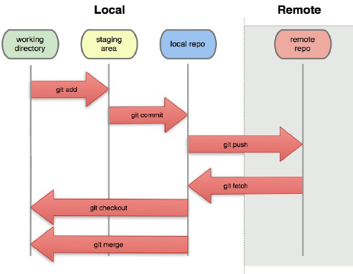

# Create a Repository on GitHub


## Steps : Create a repo using GitHub (on web browser)
- Click on `+` next to your profile picture
- Select `New Repository`
- Repository name:  `try-git`
- Description (optional):  `test project for git`
- Check box for `Initialize this repository with a README` :white_check_mark: :heavy_exclamation_mark:
- Select green button `Create repository`

# Clone a Repository
---
**Q:  What is cloning?**  
**A:  Making a copy of something.**


---

## Select green button "Clone or download" and copy url

### Go to directory on local computer  
>For me 
```bash
pwd
/e

```

### Clone repo 
```bash 
git clone https://github.com/bishalrijal/try-git.git
 ```
>for me 
```bash
git clone https://github.com/bishalrijal/try-git.git
Cloning into 'try-git'...
remote: Enumerating objects: 3, done.
remote: Counting objects: 100% (3/3), done.
remote: Total 3 (delta 0), reused 0 (delta 0), pack-reused 0
Unpacking objects: 100% (3/3), done.

```

### make some change on local 

### Change directory into your cloned repo
```bash
cd try-git/
```
### Let's make a change on local computer and push changes up to GitHub
Use an editor of your choice to create a html file which will have your name as header.
My file contains following lines of code
```html
<!DOCTYPE html>
<html>
<body>

<h1>Bishal Rijal</h1>

<p>let's make programming easier with Git.</p>

</body>
</html>
```

### Yeah!! we made a change. Does git track it?
#### let's check
to see what changes have been made, type `git status`
```bash
git status
On branch master
Your branch is up to date with 'origin/master'.

Untracked files:
  (use "git add <file>..." to include in what will be committed)

        sample.html

nothing added to commit but untracked files present (use "git add" to track)
```

# Save Changes to GitHub repo 
### What should we do? 

|:--:| 
*Figure. The lifecycle of the status of your files*

### Traking New Files
use the command `git add` to begin the tracking the sample.html
```bash
 git add sample.html
```
is that all? let's again check the status.
```bash
 git status
On branch master
Your branch is up to date with 'origin/master'.

Changes to be committed:
  (use "git reset HEAD <file>..." to unstage)

        new file:   sample.html
```

### git commit

If your staging area is setup the way you want, you can commit your changes
**If you change anything, then commit it!!**

### what is Commit?

it's a checkpoint, where you can come later if you need to.

#### lets commit changes
```bash 
 git commit -m "sample is added"
[master c68858e] sample is added
 1 file changed, 10 insertions(+)
 create mode 100644 sample.html

```

### Time to make change in GitHub repo
When you have your project at a point that you want to share, you have to push it.
```bash 
 git push origin master
Enumerating objects: 4, done.
Counting objects: 100% (4/4), done.
Delta compression using up to 8 threads
Compressing objects: 100% (3/3), done.
Writing objects: 100% (3/3), 382 bytes | 191.00 KiB/s, done.
Total 3 (delta 0), reused 0 (delta 0)
To https://github.com/bishalrijal/try-git.git
   5572e17..c68858e  master -> master
```
#### What happenes when you pushed it?
Now you've done backup to the server


