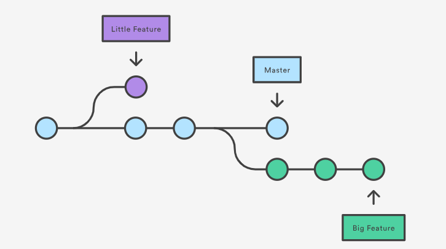
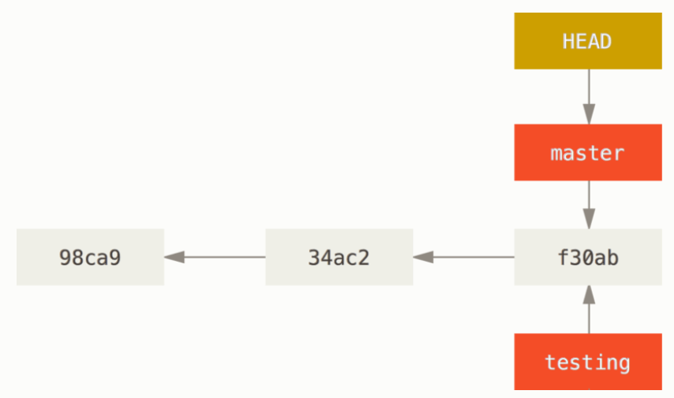
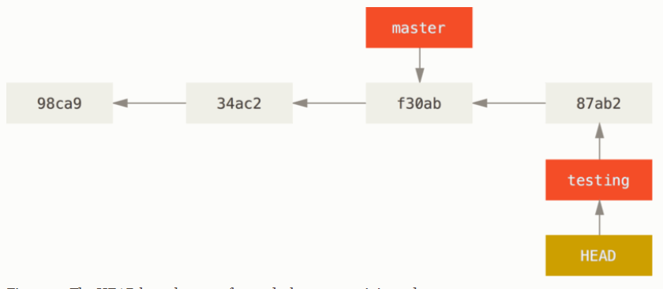
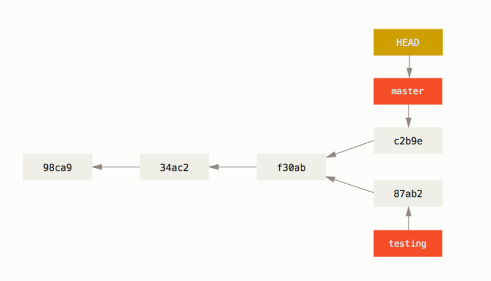

# Branches
* A branches represent an independent line of development.
## why we use braches?
* branches diverge from your main line of development and continue to do work without changing the main line
* think of them as a way to request a brand new working directory, staging area, and project history
 * in Git, branches are a part of your everyday development process. 
    * when you want to add a new feature or fix a bug—no matter how big or how small,  spawn a new branch to encapsulate your changes
    * this makes sure that unstable code is never committed to the main code base
    * it gives you the chance to clean up your feature’s history before merging it into the main branch


|:--:| 
*Figure.Branches and its commit history*

## creating a New Branch
let's say we want to craete a new branch called testing
```bash
git branch testing
```

## switching to new branch
let's switch to the new branch called testing
```bash
 git checkout testing
Switched to branch 'testing'
```

### Commit into new branch
create a new file called test.txt and write your first name into it 
let's check the status 
```bash
 git status
On branch testing
Untracked files:
  (use "git add <file>..." to include in what will be committed)

        test.txt

nothing added to commit but untracked files present (use "git add" to track)


```
let's commit it 
```bash
git commit -am 'made a change'
[testing fc90d66] made a change
 1 file changed, 1 insertion(+)
 create mode 100644 test.txt
```

## switching back to the master
```bash
 git checkout master
Switched to branch 'master'
Your branch is up to date with 'origin/master'.
```
### let's make some changes and commit again.
create a file test.txt and write your surname into it 
```bash 
git add .
 git commit -m "change made in master"
 ```
 
 

